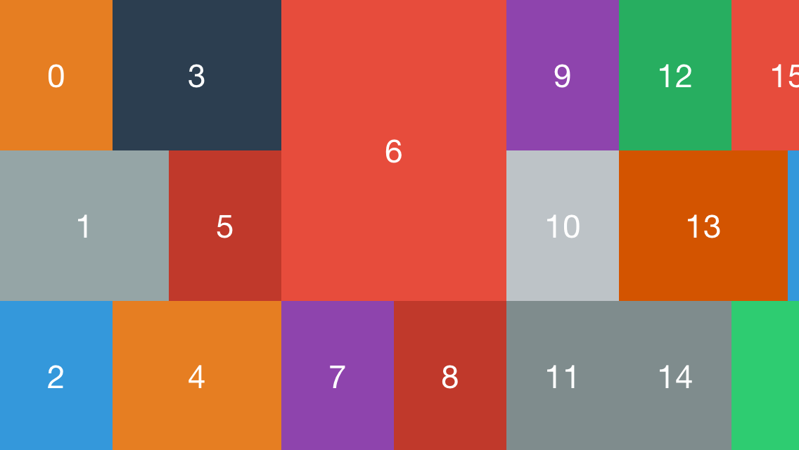

# KYTilePhotoLayout
A UICollectionViewLayout with a really interesting image layout algorithm.

一个图片布局算法，实现图片的不规则排列，并且大小不一。具体效果如图:


##垂直滚动：Vertical Scroll


##水平滚动：Horizontal Scroll



##How to use

It's just two files: `KYTilePhotoLayout.h` && `KYTilePhotoLayout.m`. And it's the subclass of `UICollectionViewLayout`.So you can easily use like a normal `UICollectionViewLayout`. eg:

###Use code:

```objc

    KYTilePhotoLayout *tileLayout = [[KYTilePhotoLayout alloc]init];
    tileLayout.ColOfPortrait  = 2;
    tileLayout.ColOfLandscape = 3;
    tileLayout.LayoutDirection =  Vertical;
    self.collectionView.collectionViewLayout = tileLayout;

```

###Use Interface Builder:

Set the layout's class to **KYTilePhotoLayout** .Then you can set the value visibly:


